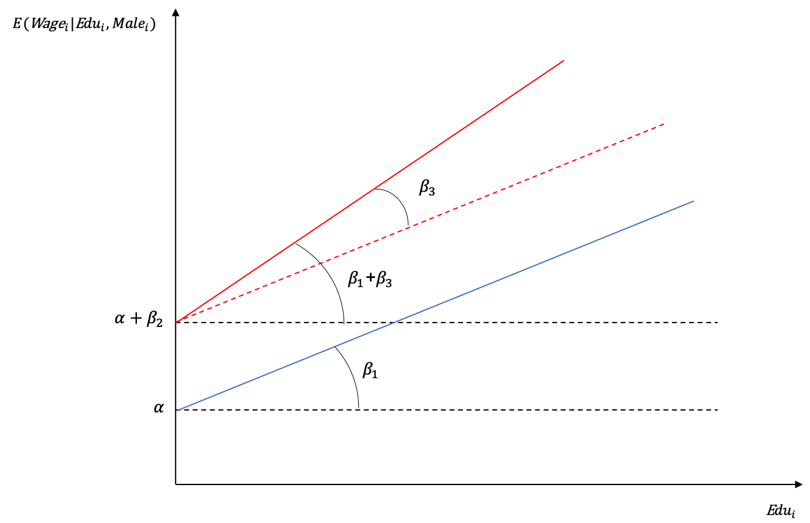
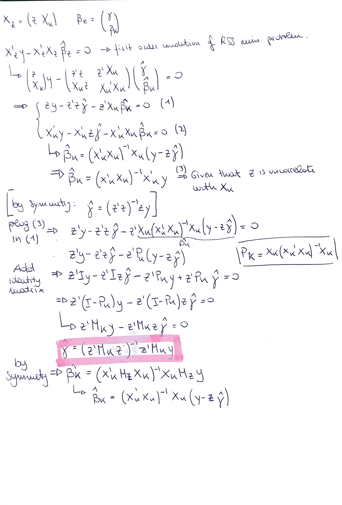

```{r global options, include=FALSE}
library(knitr)
library(Cairo)
library(extrafont)
library(latex2exp)
library(readstata13)
library(Hmisc)
library(lmtest)
library(stargazer)
library(kableExtra)
library(ggplot2)
library(data.table)
library(tidyr)
library(formatR)
library(dplyr)
library(car)
library(sjmisc)

#install.packages("pacman")
#pacman::p_load(knitr, Cairo, extrafont,latex2exp,readstata13,Hmisc,lmtest,stargazer,kableExtra,ggplot2,data.table,tidyr,formatR,dplyr,car,sjmisc) 


knitr::opts_chunk$set(echo = TRUE, fig.show = "hold", collapse = TRUE, tidy.opts=list(width.cutoff=60),tidy=TRUE,
                      fig.height = 2, fig.width = 4)

sysinf <- Sys.info()
if(sysinf['sysname'] == "Windows"){
  extrafont::loadfonts(device="win")
  #opts_chunk$set(dev = "CairoPDF")
}
```


# Paper and Pencil Questions

*(a) Show that* $TSS = ESS + RSS$*. Also, show you can write* $R^2 = 1-\frac{e'e}{\tilde{y}'\tilde{y}}$ *where* $\tilde{y}_i=y_i-\bar{y}$.

\begin{align*}
\sum_{i=1}^n{(y_i-\bar{y})^2}&=\sum_{i=1}^n{(y_i-\hat{y}_i-\bar{y})^2} \\ &=\sum_{i=1}^n{(y_i-\hat{y}_i)^2}+2\sum_{i=1}^n{(y_i-\hat{y}_i)(\hat{y}_i-\bar{y})}+\sum_{i=1}^n{(\hat{y}_i-\bar{y})^2}
\end{align*}

We need to show that $2\sum_{i=1}^n{(y_i-\hat{y}_i)(\hat{y}_i-\bar{y})}=0$. By the regression equation we know that:

$$SSE=\sum_{i=1}^n{(y_i-\hat{y}_i)^2}=\sum_{i=1}^n{(y_i-\beta_0-\beta_1x_i)^2}$$
As we minimize SSE to find $\beta_1,\beta_0$ we search for the partial derivatives:

\begin{align*}
\frac{\delta SSE}{\delta \beta_0}&=\sum_{i=1}^n{2(y_i-\beta_0-\beta_1x_i)(-1)} \overset{!}{=}0 \\
\sum_{i=1}^n{\beta_0} &= \sum_{i=1}^n{y_i}-\beta_1 \sum_{i=1}^n{x_i} \Rightarrow 0=\sum_{i=1}^n{(y_i-\hat{y}_i)} \tag{a} \\
n\beta_0 &= \sum_{i=1}^n{y_i}-\beta_1 \sum_{i=1}^n{x_i} \\
\beta_0 &= \frac{1}{n}\sum_{i=1}^n{y_i} - \beta_1 \frac{1}{n} \sum_{i=1}^n{x_i}
\end{align*}

We take the second partial derivative:

\begin{align*}
\frac{\delta SSE}{\delta \beta_1} = &\sum_{i=1}^n{2(y_i-\beta_0-\beta_1x_i)(-x_i)} \overset{!}{=}0  \\
&\sum_{i=1}^n{x_i(y_i-\beta_0-\beta_1x_i)} = 0 \\
&\sum_{i=1}^n{x_i(y_i-\hat{y_i})}
\end{align*}

By the regression equation $\hat{y}_i=\beta_0 + \beta_1x_i$, thus $x_i=\frac{\hat{y}_i-\beta_0}{\beta_1}$ and so:

\begin{align*}
\sum_{i=1}^n{\left(\frac{\hat{y}_i-\beta_0}{\beta_1}\right)(y_i-\hat{y}_i)}&=0 \\
\frac{1}{\beta_1} \sum_{i=1}^n{\hat{y}_i(y_i-\hat{y}_i)} - \frac{\beta_0}{\beta_1} \sum_{i=1}^n{(y_i-\hat{y}_i)}=&0
\end{align*}

Using equation (a) in the second part:

\begin{equation}
\sum_{i=1}^n{\hat{y}_i(y_i-\hat{y}_i)} = 0 \tag{b}
\end{equation}

We needed to show that $2\sum_{i=1}^n{(y_i-\hat{y}_i)(\hat{y}_i-\bar{y})}=0$:

$$\sum_{i=1}^n{(y_i-\hat{y}_i)(\hat{y}_i-\bar{y})}=\sum_{i=1}^n{\hat{y}_i(y_i-\hat{y}_i)}- \bar{y}\sum_{i=1}^n{(y_i-\hat{y}_i)}$$
Where the first part is 0 because of (b) and the second part because of (a).

For the second part of the question, we know that $e'e=\sum{e_i^2}=RSS$ and $\tilde{y}'\tilde{y}=\sum{y_i-\bar{y}}=TSS$. As $ESS=TSS-RSS$ and $TSS=RSS+ESS$ this becomes:

\begin{align*}
R^2 &= \frac{ESS}{TSS} \\
&= \frac{TSS-RSS}{TSS} \\
&= \frac{TSS}{TSS}-\frac{RSS}{TSS} \\
&= 1- \frac{RSS}{TSS}
\end{align*}

*(b) Show that* $R^2 = corr^2(y, \hat{y})$. *What is the intuition behind it?*

\begin{align*}
corr^2(y, \hat{y}) &= \left(\frac{Cov(y,\hat{y})}{\sqrt{Var(y)Var(\hat{y})}}\right)^2 \\
&= \frac{(Cov(y,\hat{y}))^2}{Var(y)Var(\hat{y})} \\
&= \frac{(Cov(\hat{y}+e,\hat{y}))^2}{Var(y)Var(\hat{y})} \\
&= \frac{(Cov(\hat{y},\hat{y})+Cov(\hat{y},e))^2}{Var(y)Var(\hat{y})} \\
&= \frac{(Cov(\hat{y},\hat{y}))^2}{Var(y)Var(\hat{y})} \\
&= \frac{(Var(\hat{y}))^2}{Var(y)Var(\hat{y})} \\
&= \frac{Var(\hat{y})}{Var(y)}=\frac{ESS}{TSS}=R^2
\end{align*}

The intuition behind this is how much of the total variance can be explained with our model that yields $Var(\hat{y})$.

*(c) Suppose you decided to measure all of your* $X$ *variables in different units such that your new* $X$ *variable, call it* $\tilde{X}$, *is exactly double your old one, i.e.* $\tilde{X} = 2X$. *Suppose you run the regression of* $y$ *on* $\tilde{X}$;  *call the resulting estimate* $\tilde{\beta}$. *You showed in Problem Set 1 that *$\tilde{\beta}=\frac{1}{2}\hat{\beta}$. *Is the $R^2$ different in the two models? Provide an intuitive answer.*

We have seen above that $R^2=\frac{Var(\hat{y})}{Var(y)}$. The denominator will not change as $y$ is not affected. $Var(\hat{y})$ is given by the model $\hat{y}=\beta_0+\tilde{\beta}x$. Using the hint from Problem Set 1, $\hat{y}=\beta_0+\frac{1}{2}\hat{\beta}2x$, which yields the same model as before. In other words, the new estimator $\tilde{\beta}$ adjusts for the new units in $X$. Thus $R^2$ is not going to change.

*(d) Intuitively discuss the fact that including another regressor in the linear model always decreases the* $RSS$.

Adding other regressors reduces the residual variance (as we minimize $RSS$) . More formally, by adding another variable, we add another covariance to the model which will mechanically always increase $Var(\hat{y})$ and hence $ESS$. As $RSS=TSS-ESS$, this will always decrease $RSS$.

*(e) Provide a formal proof of point (d).*

$y= X\beta+\epsilon$ gives residuals $e$ and $R^2_1$
$y= X_z\beta_z+z\gamma+\upsilon$ gives residuals $u$ and $R^2_2$

It is possible to rewrite $y= X_z\beta_z+z\gamma+\upsilon$ as $y= (X\beta+z\gamma) + \upsilon$

It's always true that adding variables like $Z\gamma$ increases $R^2$ so we will have that $R^2_2 > R^2_1$
Thus we have that: 
$$1-\frac{e'e}{\tilde{y}'\tilde{y}} < 1-\frac{u'u}{\tilde{y}'\tilde{y}}$$
And we have that: 
\begin{align*}
 e &=y-X\hat{\beta} \\ 
    &= y-X(X'X)^{-1} X'y \\
    &= (I_N - X(X'X)^{-1} X')y \\
    &= I_N - P_X y = M_x y
\end{align*}

and we can demonstrate as well that:

\begin{align*}
 u &=y-(X\widehat{\beta}+ z\widehat{\gamma}) \\ 
    &= y- X(X'X)^{-1} X'y -  z\widehat{\gamma} \\ 
    &= y - P_X y - z\widehat{\gamma}  \\
    &= e -  z\widehat{\gamma}
\end{align*}

Given that:  $$X(X'X)^{-1} X = P_X$$ 

We know that $z\widehat{\gamma}$ is and postive and non zero because: 

$$\widehat{\gamma}=(z'M_kz)^{-1}z'M_ky= (\sum z^2) \sum zy$$

At this point we can clearly see that: 

$$u'u < e'e$$

The demonstration of $\widehat{\gamma}=(z'M_kz)^{-1}z'M_ky$ is possible if we compute it using partitioned regression. The demonstration can be found in the last page of this document.  

*(f) Can you suggest a problem of interpreting the* $R^2$ *as a measure of how “good” the model is? If you think the model might not be “good”, why might it nevertheless have a high* $R^2$*?*

A good model identifies causal relationships between the dependent variable $y$ and the independent variables $x$. By adding more independent variables, we increase $R^2$ (seen above), but this tells us nothing about the causal relationship between $y$ and $x$. To identify causal relationships, we need $x$ variables with robust standard errors, however $R^2$ is not affected by the errors in $x$. This means we can have a "bad" model which still has a high $R^2$. The problem is that $R^2$ tells us how well our model fits the sample. If we only try to increase $R^2$, we have a tendency to overfit the model to the sample at hand, but might ignore the causal relationships of the true population.

# The gender wage gap

*Suppose you want to test whether in your country women are discriminated against  relative to men in terms of wages. You decide that you want to test whether men and women have different salaries. Suppose you are able to gather data on the whole working population in your country. For each individual you have the following information.*

* *monthly wage*
* *gender*
* *years of education*

*(a) Suppose years of education have the same effect on wages for both men and women. Propose a simple regression model to test your hypothesis.*
$$ Wage_i = \alpha + \beta_1Edu_i + \beta_2Male_i + \epsilon_i$$
Where *Male* is a dummy variable which takes value 0 for females and 1 for male observations. 

*(b) Provide a graphical representation of the conditional expectation function (i.e. the part of wages that we can explain with our covariates) and show if and how it differs for men and women.*


$$E(Wage_i|Edu_i,Male_i)=\begin{cases}
    \alpha + \beta_1Edu_i ,& \text{if } Male_i = 0\\
     \alpha  + \beta_1Edu_i + \beta_2 ,& \text{if } Male_i = 1
\end{cases}$$

For the graphical representation see Figure 1.

*(c) In retrospect, you decide that years of education might have a different marginal effect on men compared to women. How would you modify your regression model to account for this differential effect?*

$$ Wage_i = \alpha + \beta_1Edu_i + \beta_2Male_i + \beta_3Edu_i \times Male_i + \epsilon_i $$

*(d) Provide a graphical representation of the conditional expectation function (i.e. the part of wages that we can explain with our covariates) and show if and how it differs for men and women*


$$E(Wage_i|Edu_i,Male_i)=\begin{cases}
    \alpha + \beta_1Edu_i ,& \text{if } Male_i = 0\\
     \alpha  + \beta_1Edu_i + \beta_2 + \beta_3Edu_i & \text{if } Male_i = 1
\end{cases}$$

For the graphical representation see Figure 2.

# Empirical Application
**1. The Gender Wage Gap.** *In this exercise we will try to explore some discrimination theories analyzing a subsample from the US CPS2015. Many politicians, institutional observers, and researchers still claim today the existence of discrimination against female workers in the labor market. They base their claims looking at the gender wage gap, i.e. the difference between men’s and women’s wages. As many other things in
economics, this wage gap can be generated both from the demand side (employers who discriminate against women) and from the supply side (women having different skills or preferences for specific jobs or for entering the labor market at all). In this exercise we will try to learn more about the gender wage gap, while testing you on your econometric toolkit. For this question, assume that Assumption 2 (Mean-zero Error) holds so that you can make causal statements in your answers.*

*Download the dataset sampleUScens2015.csv from OLAT and import it into Stata or R. The dataset includes prime age individuals (i.e. *age $\in [25; 54]$) *active in the labor market (i.e. either employed or looking for job), and working in the private sector. There are seven relevant variables:*

* *age*, the age of the individual in 2015
* *education*, years of completed education
* *incwage*, income from wages in 2015 in USD
* *female*, dummy for female
* *childrenly*, dummy if had a children in the last year
* *degfield*, field of degree
* *occupation*, sector of occupation

At first we need to load the data in order to start our analysis:
```{r results='hide'}
USCPS <- fread('sampleUScens2015.CSV')
head(USCPS) # Check the format
dim(USCPS) #Check length
summary(USCPS) #Explore the data
```
The summary tells us that there are some NAs in $educ$, we want to explore this:
```{r results='hide'}
head(USCPS[rowSums(is.na(USCPS)) > 0,])
```
The other columns seem fine, we could still keep these observations in the dataset. However, the data quality on these 45 observations seems poor anyway as $firmsector, occupation$ and $degfield$ are in most cases "other", which is not really informative. Also, 45 observations are just a tiny fraction of the overall sample. As it is easier to work with a complete dataframe, we drop the observations containing NAs:
```{r results='hide'}
USCPS <- USCPS %>% drop_na()
```

*(a) Generate a new variable called* $wage = incwage/1000$. *Also, generate* $lw$ *taking the log of wage. Generate a dummy named university which is equal to 1 if* $education \geq 16$. *First regress wage on education, then regress wage on education and the university dummy. How does the coefficient on education change? How do you interpret it in both specifications?*

**Create the variables**
```{r}
USCPS$wage <- USCPS$incwage/1000 #create wage
USCPS$lw <- log(USCPS$wage) #create log wage
USCPS$university <- as.numeric(USCPS$educ >= 16) #create university dummy

```

**Run the regressions**
```{r, message=FALSE, warning=FALSE, results='asis'}
Model1 = wage ~ educ
lm1 <- lm(Model1, data = USCPS, x=TRUE)
Model2 = wage ~ educ + university
lm2 <- lm(Model2, data = USCPS, x=TRUE)
```
```{r tab1, echo=FALSE, message=FALSE, warning=FALSE, results='asis'}
stargazer(lm1, lm2, title="Regression Results Wage Education University", type="latex", header = FALSE,
 align=TRUE, dep.var.labels=c("Wage"),
 covariate.labels=c("Education","University"),
 omit.stat=c("all"), no.space=TRUE)

```

Without the university dummy, a 1 year increase in education is reflected by a wage increase of 7.074 USD (Table 1). By adding the dummy $university$ we separate the effect of years of education from years of university education. This results in a decreased coefficient for $Education$, 4.975 wheras the dummy term tells that people who attended university earn on average 15.18 USD more. By the drop in $Education$ we learn that 7 USD return for an additional year of education was at least partially driven by higher earnings of workers who attended university.

*(b) Drop the university dummy. Now regress wage on education and age. Also, regress log wages (lw) on education and age. What are their coefficients? How do you interpret them? How do they compare? [Note: be sure you compare approximately equivalent objects from each specification.]*

```{r, message=FALSE, warning=FALSE, results='asis'}
Model3 = wage ~ educ + age
lm3 <- lm(Model3, data = USCPS, x=TRUE)
Model4 = lw ~ educ + age
lm4 <- lm(Model4, data = USCPS, x=TRUE)
```
```{r, echo=FALSE, message=FALSE, warning=FALSE, results='asis'}
stargazer(lm3, lm4, title="Regression Results Wage Education Age", type="latex", header = FALSE,
 align=TRUE, dep.var.labels=c("Wage","Log Wage"),
 covariate.labels=c("Education","Age"),
 no.space=TRUE)
```


**Interpretation Model 1:**One year increase in education controlling for age increases wage by 7.17USD. One year increase in age controlling for education increases wage by 1.461USD (See Table 2).

**Interpretation Model 2:**One year increase in education controlling for age increases wage by 12%. One year increase in age controlling for education increases wage by 2.5%.

**Comparison:**Model 1 measures in level-level terms whereas model 2 measures in log-level terms. While they both measure the effect of education and age on wage, one measures the effect of education/age on wage in absolute terms and the other in percentage points.

*(c) Now regress log wages on education, age, and the female dummy. You get the following model:*
$$lw_i = \beta_1 + \beta_2educ_ii + \beta_3age_i + \beta_4female_i + \epsilon_i$$

*What is the coefficient on female? How do you interpret it? Is it economically significant in your opinion? Test both in R/Stata and “by hand” the hypothesis that* $\beta_4 = 0$. *Should you use a one-sided or two-sided test? Do the one you think most appropriate.*
```{r, message=FALSE, warning=FALSE, results='asis'}
Model5 = lw ~ educ + age + female
lm5 <- lm(Model5, data = USCPS, x=TRUE)
```
```{r, echo=FALSE, message=FALSE, warning=FALSE, results='asis'}
stargazer(lm5, title="Regression Results Education Age Gender", type="latex", header = FALSE,
 align=TRUE, dep.var.labels=c("Log Wage"),
 covariate.labels=c("Education","Age","Female"),
 no.space=TRUE, p.auto = TRUE)
```

Females earn on average 44.25% less than males with the same education and age (see Table 3). This is economically significant, by using the average wage and multiplying with the female coefficient we get `r round(mean(USCPS$wage)*0.4425,2)`, a substantial difference.

To test in R whether $\beta_4 = 0$, we can simply look at the p-value of the female coefficient and see that is well below 5%. Using $\alpha=5\%$, we can state that $\beta_4$ is significantly different from 0. 

By hand:
$$ H_0: \beta_4 = 0\space \textrm{and} \space H_1: \beta_4 \neq 0$$
Calculate degrees of freedom:
$$N-K=561076-4=561072$$
Construct test statistic:

$$\frac{\hat{\beta_4}-\beta_4}{stderr(\hat{\beta_4})}=\tilde{t}=\frac{-0.4427-0}{0.0024}=-184,46$$


Now we look up in a t-table to find the critical value to find that the critical value $\bar{t}_{-184.46}=-1.967$ for $\alpha=5\%$. As $-184,46<-1.967$, we can reject $H_0$ and state that the coefficient is significantly different from 0 at the 5% confidence level. We used a two-sided test here because the question was to identify if the effect is different from 0, which can go both ways.

*(d)* *Use R/Stata to get $\beta_4$ (the coefficient on female) using partitioned regression as we did in lecture.* 

Given that: 

\begin{align*}
Y &=\beta X +\epsilon_{i} \\ &=X_k \beta_{k} + X_{-k} \beta_{-k} +\epsilon_{i}
\end{align*}

The idea of partitionated regression is to show that The $k^th$ coefficient in a multiple OLS regression is equivalent to the
coefficient in a simple OLS regression of the y on the residual from a regression of $X_k$ on all the other regressions. In this case, the first step is to regress the fact of being female on the education and age to see how much of the variance is explained by those. 
```{r, message=FALSE, warning=FALSE, results='asis'}
Model6 = female ~ educ + age
lm6 <- lm(Model6, data = USCPS, x=TRUE)
```
```{r, echo=FALSE, message=FALSE, warning=FALSE, results='asis'}
stargazer(lm6, title="Female on Education and Wage", type="latex", header = FALSE,
          align=TRUE, dep.var.labels=c("Female"),
          covariate.labels=c("Education","Age"),
          no.space=TRUE, p.auto = TRUE)
```
Log wage is regressed on the residuals of the last regression and it is possible to see that in both Model 7 and Model 5 the coefficient of the female and of the residuals is the same. 
```{r, message=FALSE, warning=FALSE, results='asis'}
fem_res <- residuals(lm6) # Save the female residual values

Model7 = lw ~ fem_res
```
```{r, echo=FALSE, message=FALSE, warning=FALSE, results='asis'}
lm7 <- lm(Model7, data = USCPS, x=TRUE)
stargazer(lm7, title="Log Wage on Female Residuals", type="latex", header = FALSE,
          align=TRUE, dep.var.labels=c("Log Wage"),
          covariate.labels=c("Female Residuals"),
          no.space=TRUE, p.auto = TRUE)
```
This demonstrates that the only variation left in the variable "female" to identify its coefficient is the variation left after running a regression of female on education and age.

*(e) Use R/Stata to show that* $\hat{\beta_1}=\bar{y}-\bar{X}'_{-1}\hat{\beta}_{-1}$

```{r}
Beta_hat <- c(summary(lm5)$coefficients[2,1], summary(lm5)$coefficients[3,1], summary(lm5)$coefficients[4,1])
X_bar <- c(mean(USCPS$educ), mean(USCPS$age), mean(USCPS$female))
Beta_hat_1 <- mean(USCPS$lw)-sum(Beta_hat*X_bar)
print(Beta_hat_1) # calculated constant
print(summary(lm5)$coefficients[1,1]) # constant from the model
```
*(f) Include in the model in (1c) the interaction between female and education, together with the interaction between female and age. So your model is now:*
\begin{align*}
lw_i = &\beta_1 + \beta_2educ_i + \beta_3age_i + \beta_4female_i +\\
&\beta_5female_i\times educ_i+\beta_6 female_i\times age_i + \epsilon_i
\end{align*}
*Test in R/Stata the individual hypotheses that* $\beta_4 = 0, \beta_5 = 0$, and $\beta_6 = 0$. *Test “by hand” and in R/Stata the joint hypothesis that they are all zero.*

```{r}
Model8 = lw ~ educ + age + female + female:educ + female:age
lm8 <- lm(Model8, data = USCPS, x=TRUE)
```
```{r, echo=FALSE, message=FALSE, warning=FALSE, results='asis'}
stargazer(lm8, title="Wage on Education, Age and Gender", type="latex", header = FALSE,
 align=TRUE, dep.var.labels=c("Log Wage"),
 covariate.labels=c("Education","Age","Female", "Female x Education", "Female x Age"),
 no.space=TRUE, p.auto = TRUE)
```
$\beta_4, \beta_5, \beta_6$ are significantly different from zero with a p-value of well below 5% (see Table 6).

For the joint significance test, we first formulate our hypothesis:
\begin{align*}
&H_0: \beta_4+\beta_5+\beta_6 = 0\\
&H_1: \beta_4+\beta_5+\beta_6 \neq 0
\end{align*}

\begin{align*}
&\textrm{Restricted Model:} lw_i = \beta_1 + \beta_2educ_i + \beta_3age_i + \epsilon_i \\
&\textrm{Unrestricted Model:} lw_i = \beta_1 + \beta_2educ_i + \beta_3age_i + \beta_4female_i +\beta_5female_i\times educ_i+\beta_6 female_i\times age_i + \epsilon_i
\end{align*}

$$F=\frac{(R^2_U-R^2_R)/q}{(1-R^2_U)(N-K)}$$
We identify the single elements: $R^2_U$ is `r summary(lm8)$r.squared` from the summary statistics of lm6. Same for $R^2_R$, found in the summary statistics of lm4: `r summary(lm4)$r.squared`.

\begin{align*}
DF_U=561076-6=561070 \qquad DF_R=561076-3=561073 \qquad q=DF_R-DF_U=3 \\
F=\frac{(0.207-0.158)/3}{(1-0.207)(561076-6)}= 11556.3
\end{align*}

Looking up in a F-table, we find the critical value to be 1 at an $\alpha=5\%$, we can reject the null hypothesis.

*(g)Run again the model in (1c) separately for males and females. How do the coefficients for educ and age in the males regression compare to the coefficient estimates in part (1f)? How do the coefficients for educ and age in the females regression compare to the coefficient estimates in part (1f)? What does this tell you about the impact of interacting a dummy variable with all the other variables (including the constant) in a regression?*

Note that we exclude the gender dummy from the model because it become singular.

```{r, message=FALSE, warning=FALSE, results='asis'}
lm9 <- lm(Model5, data = dplyr::filter(USCPS,female==0), x=TRUE)
lm10 <- lm(Model5, data = dplyr::filter(USCPS,female==1), x=TRUE)
```
```{r, echo=FALSE,message=FALSE, warning=FALSE, results='asis'}
stargazer(lm8,lm9,lm10, title="Regression Results for gender-separated samples", type="latex", header = FALSE,
 align=TRUE, dep.var.labels=c("Log Wage"),
 covariate.labels=c("Education","Age","Female", "Female x Education", "Female x Age"),
 column.labels = c("Combined","Male", "Female"),
 omit.stat=c("all"),
 no.space=TRUE, p.auto = TRUE)
```

The coefficients nicely add up to each other. For male they are the same because we isolated female effects (see Table 7). To arrive at the female coefficients, we simply add education plus $Female \times Education$, same goes for wage. This means that by using an interaction variable, we can combine more information in one regression instead of creating two single regressions and comparing them. Interacting a dummy on all variables isolates the effect on the dummy subsample.

*(h) Generate a dummy for each occupation category. Can you include all of them in your model? Why or why not?*
```{r}
USCPS <- USCPS %>% 
  to_dummy(occupation, var.name = "label", suffix = "label") %>% 
  bind_cols(USCPS)

```
We cannot include all dummies in the model because then we would fall into the "dummy trap": by using all dummies we would include perfect multicollinearity as the value of one occupation is inherently defined by all other occupations. Hence we need to drop one dummy.

*(i) Now test the model in part (1c) for each occupational subsample (i.e. perform the regression in part (1c) each occupation at a time). Comment on the pattern of your wage gap estimates across occupations. Is the gender wage gap statistically different across occupations? Provide support for your conclusions.*

```{r, message=FALSE, warning=FALSE, results='asis'}
lm11 <- lm(Model5, data = dplyr::filter(USCPS,occupation_other==1), x=TRUE)
lm12 <- lm(Model5, data = dplyr::filter(USCPS,occupation_healthcare==1), x=TRUE)
lm13 <- lm(Model5, data = dplyr::filter(USCPS,occupation_technology==1), x=TRUE)
lm14 <- lm(Model5, data = dplyr::filter(USCPS,occupation_business==1), x=TRUE)
lm15 <- lm(Model5, data = dplyr::filter(USCPS,occupation_science==1), x=TRUE)
```
```{r, echo=FALSE, message=FALSE, warning=FALSE, results='asis'}
stargazer(lm11,lm12,lm13,lm14,lm15, title="Regression Results for different Occupations", type="latex", header = FALSE,
 align=TRUE, dep.var.labels=c("Log Wage"),
 covariate.labels=c("Education","Age","Female"),
 column.labels = c("Other","Healthcare", "Technology", "Business", "Science"),
 omit.stat=c("all"),
 no.space=TRUE, p.auto = TRUE)
```

It is not possible to compare the coefficients of different sub-samples and perform a hypothesis test (see Table 8). What we need is a combined model that interacts the female and the occupation dummy (careful to avoid the dummy trap):

```{r, message=FALSE, warning=FALSE, results='asis'}
Model10 <- lw ~ educ + age + female + occupation_healthcare:female + occupation_technology:female + occupation_business:female + occupation_science:female
lm16 <- lm(Model10, data = USCPS, x=TRUE)
```
```{r, echo=FALSE, message=FALSE, warning=FALSE, results='asis'}
stargazer(lm16, title="Combined Model for occupations", type="latex", header = FALSE,
 align=TRUE, dep.var.labels=c("Log Wage"),
 covariate.labels=c("Education","Age","Female", "Female x Healthcare", "Female x Technology", "Female x Business", "Female x Science"),
 omit.stat=c("all"),
 report = ("vc*p"),
 no.space=TRUE, p.auto = TRUE)
```
We want to prove that the gender gap is different across occupations, in order to do this we need to take a look at the p-values of the various interaction terms that states if change in wage of women in that field is significantly different from 0. Using $\alpha = 5\%$, we can state that the wage gap is not significant in business and science. Hence the wagegap mostly comes from $healthcare$, $technology$ and $other$ occupations (see Table 9).

*(j) Drop all the males from your dataset.*
```{r}
USCPS <- dplyr::filter(USCPS,female==1)
```
  *i) Regress log wages on educ, age, and childrenly. Test in R/Stata H1 : childrenly < 0 for workers in technology. Is the effect negative in every occupation? Provide support for your conclusion.*
```{r, message=FALSE, warning=FALSE, results='asis'}
Model11 <- lw ~ educ + age + childrenly
lm11Female <- lm(Model11, data = dplyr::filter(USCPS,occupation_other==1), x=TRUE)
lm12Female <- lm(Model11, data = dplyr::filter(USCPS,occupation_healthcare==1), x=TRUE)
lm13Female <- lm(Model11, data = dplyr::filter(USCPS,occupation_technology==1), x=TRUE)
lm14Female <- lm(Model11, data = dplyr::filter(USCPS,occupation_business==1), x=TRUE)
lm15Female <- lm(Model11, data = dplyr::filter(USCPS,occupation_science==1), x=TRUE)
```

```{r, echo=FALSE, message=FALSE, warning=FALSE, results='asis'}
stargazer(lm11Female,lm12Female,lm13Female,lm14Female,lm15Female, title="Regression Results for different Occupations on only Females", type="latex", header = FALSE,
 align=TRUE, dep.var.labels=c("Log Wage"),
 covariate.labels=c("Education","Age","Children"),
 column.labels = c("Other","Healthcare", "Technology", "Business", "Science"),
 omit.stat=c("all"),
 report = ("vc*t"),
 no.space=TRUE, p.auto = TRUE)
```

With $H_1: \beta_{children}<0$, $H_0: \beta_{children}>0$. In a one-sided test critical value is 1.64, $\tilde{t}<1.64$ cause us to reject $H_0$. By looking at the reported t-statistics, we can find that we can reject $H_0$ in all occupations other than business" (see Table 10). We can confirm $H_1$ in technology, but it cannot be confirmed in all occupations.

  *ii) Regress log wages on educ, age, childrenly, and occupation dummies (exclude the dummy for “other”). Following the “p-value” path, test whether the gender wage gap is the same in business and science (i.e. test* $\beta_{business} = \beta_{science}$). *Do the test both in R/Stata and “by hand”. How does your answer compare to Stata’s/R’s?*
```{r, message=FALSE, warning=FALSE, results='asis'}
Model12 <- lw ~ educ + age + childrenly + occupation_healthcare + occupation_technology + occupation_business + occupation_science
lm18 <- lm(Model12, data = USCPS, x=TRUE)
```
```{r, echo=FALSE, message=FALSE, warning=FALSE, results='asis'}
stargazer(lm18, title="Occupation Dummies with Children", type="latex", header = FALSE,
 align=TRUE, dep.var.labels=c("Log Wage"),
 covariate.labels=c("Education","Age","Children", "Healthcare", "Technology", "Business", "Science"),
 no.space=TRUE, p.auto = TRUE)
```


Test $\beta_{business} = \beta_{science}$ in R:
```{r}
linearHypothesis(lm18, c("occupation_business=occupation_science"))
```

By hand:
$$ H_0: \beta_{business} - \beta_{science} = 0\space \textrm{ and }\space H_1: \beta_{business}-\beta_{science} \neq 0$$
$$t=\frac{\hat{\beta}_{Business}-\hat{\beta}_{Science}-0}{Var(\hat{\beta}_{Business})+Var(\hat{\beta}_{Science})-2*Cov(\hat{\beta}_{Business},\hat{\beta}_{Business})}$$
We can extract these values by the coefficients and the variance-covariance Matrix (command vcov()) of our model lm18 (see Table 11) and plug in:
```{r}
Beta_business <- lm18$coefficients[7]
Beta_science <- lm18$coefficients[8]
Variance_Beta_business <- vcov(lm18)[7,7]
Variance_Beta_science <- vcov(lm18)[8,8] #Variance Beta_Science
Covariance_Business_Science <- vcov(lm18)[8,7] #Covariance Beta_Business Beta_Science
t <- (Beta_business-Beta_science)/(Variance_Beta_business+Variance_Beta_science-2*Covariance_Business_Science)
```

```{r echo=FALSE}
variabletable <- data.frame(Beta_business,Beta_science,Variance_Beta_business,Variance_Beta_science,Covariance_Business_Science,t)

kable(variabletable,
      row.names = FALSE,
      format = 'latex') %>% kable_styling(latex_options="scale_down")
```

We go to a t-table to find that the p-value is 0% (as we could only find a t-table that sets DF=$\infty$ with the number of observations that are in the table). This aligns with the result R calculated, which is marginally above zero. 

  *iii. How do occupations’ dummies compare to point (1i)?*
  
The results from the dummies nicely illustrate why we should not compare different models to each other in (1i). I.e. the average change in earnings for females in the healthcare sample was $\sim 1.30-0.19=1.11$ while it was  $\sim 0.94-0.36=0.58$ in the model including all female observations and the occupation dummies. The model from the subsample may suffer from unexplained variance and thus biased estimators. Also, the dummy modely confirms our proposed solution to check if the gender wage gap is different across industries using interaction variables: the estimates are approximately the same.

*(k) Throughout this question we have assumed that Assumption 2 holds. What do you think about this assumption? Can you think about other factors we did not take into consideration in our model that could bias the conclusion that we are measuring the true gender wage gap?*

Assumption 2 is one of the two "key assumptions". If it is violated, our estimates might be biased because we are also measuring some relation within the error (covariance between $x_i$ and $\epsilon_i$). So it is vital to verify that assumption 2 holds first.

The main sources of this bias are: omitted variable and/or measurment error. The first one could be due to the fact the we don't have a variable for location and the second given by the fact that people self report the wages and thus they are introducing noise in the model. 

